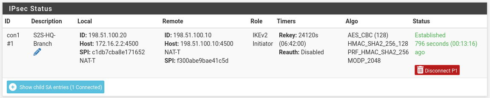
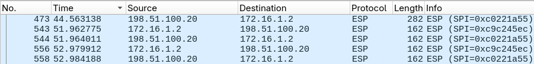

# Section 3. Site-to-Site IPsec VPN

This section details the setup for the IKEv2 tunnel between pfSense-HQ and pfSense-Branch, riding over the RouterOS 1:1 NAT rules. All configurations are done on both firewalls.

* * *

### Set up phase 1 (IKE)

Add configuration for phase 1 of IPsec tunnel. On both FWs: VPN -> IPsec -> Tunnels -> Add P1

- Key Exchange: IKEv2, Protocol: IPv4, Interface: WAN
- Remote Gateway: peer's NAT'd public IP (From HQ -> 198.51.100.20, from Branch -> 198.51.100.10)
- Authentication Method: Mutual PSK, pre-shared key typed must match on both sides
- My identifier / Peer identifier: NAT'd public IPs
- Proposal: AES-CBC-128 / SHA256 / DH14, must match both sides
- NAT Traversal: forced

* * *

### Set up phase 2 (child SA)

After adding phase 1, add a new phase 2 entry:

- Mode: Tunnel IPv4, Protocol: ESP
- HQ: Local Network: 10.0.10.0/24, Remote Network: 10.0.40.0/24
- Branch: Local Network: 10.0.40.0/24, Remote Network: 10.0.10.0/24

* * *

### Configure firewall rules

Configure firewall rules on both boxes for IPsec connection:

- **WAN:** Allow UDP/500, UDP/4500, ESP from peer's public IP.
- **IPsec:** Allow Peer's LAN -> Local LAN.

* * *

### Verify

**1\. Test site-to-site tunnel connection**

Ping from the BRANCH LAN address to HQ's LAN address:

```
ping -S 10.0.40.1 -c 3 10.0.10.2
```

Go to Status -> IPsec -> Overview to check P1 and P2 connections.



**2\. Packet capture analysis**

From the packet capture on Branch's WAN interface, traffic between the firewalls have been encrypted:



* * *

### Troubleshooting log

**Issue 1 - IKE_AUTH → AUTHENTICATION_FAILED:**

- Symptom: Failed initial IKE authentication at phase 1, IPsec tunnel not established
- Cause: My identifier left on default, resolved to real WAN IP 172.16.1.2 instead of 198.51.100.10. PSK lookup is identity-keyed, so Branch had no matching key for the identifier it received.
- Fix: Set My/Peer identifier to the NAT'd IPs on both firewalls.

**Issue 2 - Established tunnel, but ping 100% loss:**

- Symptom: SA established, but both firewalls can't ping each other.
- Causes:
    - The rule on the IPsec tab was scoped to TCP only, silently dropping decrypted ICMP.
    - The source was set to peer's public IP address instead of peer's LAN, which after decryption will be dropped on the local LAN gateway interface.
- Fix: Change the protocol to any, set source as peer's local LAN instead of peer's public IP.

[<- Previous Section](./Section2.md) | [Next Section ->](./Section4.md)