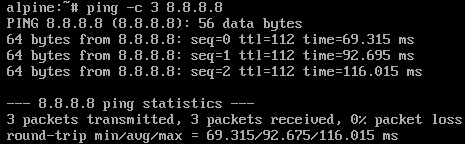
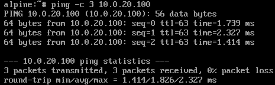
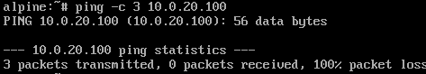
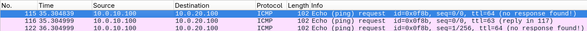
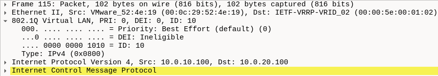
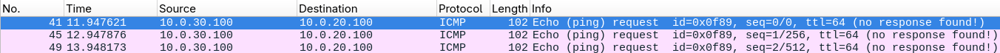
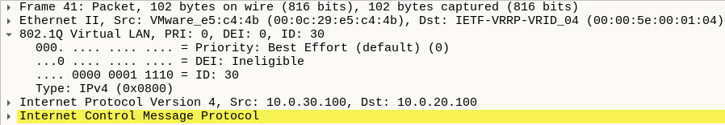

# Section 4. 802.1Q VLAN Segmentation

This section details the setup for VLAN segmentation in HQ's network through establishing 802.1Q tagged traffic between pfSense-HQ-Primary and the OpenWRT switch, along with basic firewall rules for each LAN on both sites.

* * *

### Set up OpenWRT management interface

**1\. Remove eth0 from default bridge**

Once logged in to the VM, type the following command:

```bash
uci del_list network.@device[0].ports='eth0'

```

**2\. Define mgmt as a static interface**

```bash
uci set network.mgmt=interface
uci set network.mgmt.device='eth0'
uci set network.mgmt.proto='static'
uci set network.mgmt.ipaddr='10.0.100.5'
uci set network.mgmt.netmask='255.255.255.0'
```

**3. Add mgmt to the LAN firewall zone for Web UI to be accessible**

```bash
uci add_list firewall.@zone[0].network='mgmt'

```

**4\. Commit configuration changes and restart services**

```bash
uci commit network
uci commit firewall
/etc/init.d/network restart
/etc/init.d/firewall restart
/etc/init.d/uhttpd restart
```

After the services have restarted, the graphical web interface can be accessed through 10.0.100.5 from the host machine.

* * *

### Set up OpenWRT ports

**1\. Add bridge ports to bridge device**

Once logged in to the web UI: Network -> Interfaces -> Devices -> br-lan -> Configure... -> Bridge ports. Select eth1, eth2, eth3 and eth4 as bridge ports.

**2\. Add VLANs and configure tagging**

Switch to the Bridge VLAN filtering tab:

- Check Enable VLAN filtering
- eth1: set to **T** (tagged) for VLAN IDs 10, 20, 30 - trunk port
- eth2: **U** (untagged) for VLAN 10 - access port for INTERNAL
- eth3: **U** (untagged) for VLAN 20 - access port for DMZ
- eth4: **U** (untagged) for VLAN 30 - access port for GUEST

* * *

### Configure VLAN interfaces

**1\. Add VLAN subinterfaces**

From the web UI: Interfaces -> VLANs, add 3 entries, all on the same parent trunk interface (em3) with the same tags as the VLANs configured on OpenWRT.

**2\. Assign IP addresses to subinterfaces**

Switch to the Interfaces Assignments, save the first unoccupied address (.1) for the CARP VIP:

- em3.10 (INTERNAL): Reassign to the pre-existing LAN interface address (10.0.10.2/24).
- em3.20 (DMZ): 10.0.20.2/24
- em3.30 (GUEST): 10.0.30.2/24
- em3 (TRUNK): Remove the address for the initial LAN interface.

**3\. Set up DHCP servers**

Go to Services -> DHCP Server: Enable the server for each subinterface (INTERNAL, DMZ, GUEST), set address pool range to .100 - .200 on each subnet. Leave

* * *

### Set up basic firewall rules

**1\. Set aliases**

On both firewalls, go to Firewall -> Aliases -> Add:

- MGMT_subnets: 10.0.100.0/24, 10.0.101.0/24
- Private_subnets : 10.0.0.0/16
- FW_access_ports: 22, 80, 443

**2\. Configure firewall rules**

Configure firewall rules for each LAN on both boxes:

- **INTERNAL (VLAN10):** Block INTERNAL subnets -> MGMT_subnets, TCP/FW_access_ports on This firewall (self), Allow INTERNAL subnets -> any
- **DMZ (VLAN20):** Block DMZ subnets -> MGMT_subnets, INTERNAL subnets, GUEST subnets, TCP/FW_access_ports on This firewall (self), Allow DMZ subnets -> any
- **GUEST (VLAN30):** Allow UDP/53 -> Firewall (for DNS queries), Block GUEST subnets -> Private_subnets, TCP/FW_access_ports on This firewall (self), Allow GUEST subnets -> any
- **BRANCH:** Block BRANCH subnets -> MGMT_subnets, TCP/FW_access_ports on This firewall (self), Allow BRANCH subnets -> any

**3\. Configure outbound NAT rules**

On both boxes, Firewall -> NAT -> Outbound -> select Manual Outbound NAT, add a rule of each LAN:

- Interface: WAN
- Source: INTERNAL/DMZ/GUEST/BRANCH subnets
- Address: WAN Address

* * *

### **Verify**

**1\. Test connectivity to internet**

Ping 8.8.8.8 to test connectivity:

```
ping -c 3 8.8.8.8
```

From INTERNAL host at 10.0.10.100:



From GUEST host at 10.0.30.100:


**2\. Test inter-LAN rules**

Ping DMZ host at 10.0.20.100 to test VLAN segmentation:

```
ping -c 3 10.0.20.100
```

From INTERNAL host:



From GUEST host:



**3\. Packet capture analysis**

ICMP traffic from INTERNAL host, each frame now has an 802.1Q header:

 

ICMP traffic from GUEST host:

 

[<- Previous Section](./Section3.md) | [Next Section ->](./Section5.md)