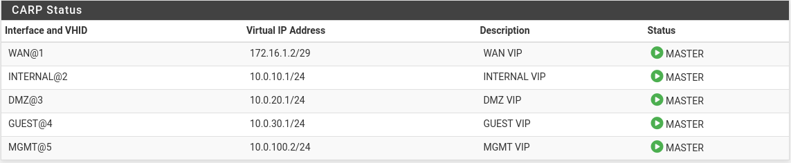
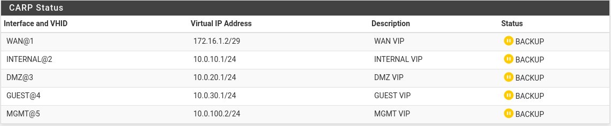
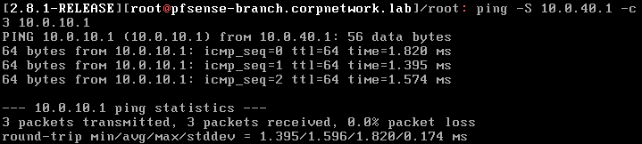
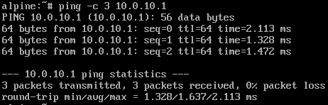
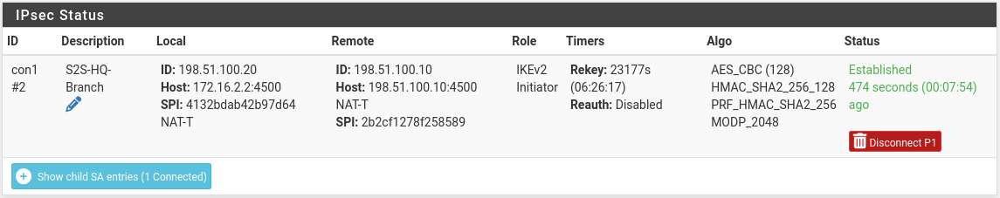

# Section 5. CARP High Availability Clustering

This section details the setup for an active/passive pfSense CARP cluster at HQ (pfSense-HQ-Primary/pfSense-HQ-Secondary) and CARP VIPs for WAN, INTERNAL, DMZ, and GUEST subnets.

* * *

### Set up CARP VIPs

**1\. Add Virtual IPs**

On Primary, go to Firewall -> Virtual IPs -> Add a CARP type VIP for each interface:

- WAN: 172.16.1.2/29, VHID: 1
- INTERNAL: 10.0.10.1, VHID: 2
- DMZ: 10.0.20.1, VHID: 3
- GUEST: 10.0.30.1, VHID: 4
- MGMT: 10.0.100.1, VHID: 5

**2\. Fix DHCP gateway and DNS**

Previously, DHCP settings for gateway and DNS were left blank. This will default to Primary's own .2 address, rather than the VIP, which will not guarantee a connection to the gateway from LAN hosts on the event of a failure on Primary. For each subinterface in the DHCP server section, change:

- Gateway: 10.0.10.1 (INTERNAL), 10.0.20.1 (DMZ), 10.0.30.1 (GUEST)
- DNS Server: 10.0.10.1 (INTERNAL), 10.0.20.1 (DMZ), 10.0.30.1 (GUEST)

**3\. Fix WAN outbound rules**

Previously, each outbound rules were translated to Primary's own WAN address (172.16.1.3), set this to the WAN VIP (172.16.1.2) for each outbound rule to ensure outbound traffic is guaranteed on failover.

**4\. Fix IPsec tunnel connection**

Edit previously configured phase 1 of tunnel, set Interface as the WAN VIP (172.16.1.2) rather than as WAN.

* * *

### Setup pfSense-HQ-Secondary

Ensure Secondary's interfaces are assigned in the exact same top-to-bottom order as Primary: WAN (wan) -> MGMT (lan) -> TRUNK (em3) -> SYNC (em2).

**1\. Assign initial Secondary addresses**

From the console -> option 2 (Set interface IP addresses):

- WAN (em0): 172.16.1.4/29, GW: 172.16.1.1
- LAN (em1): 10.0.100.4/24

**2\. Back up Primary's config**

From Primary, Diagnostics -> Backup & Restore ->Select backup area as All -> Download.

**3\. Restore interfaces and VLANs to Secondary**

On Secondary's web UI, Diagnostics -> Backup & Restore:

- Select Primary's backup, first set restore area as VLANs and restore VLAN configurations
- Set restore area as Interfaces and restore interface configurations

**4\. Re-address Secondary's interfaces**

- WAN: 172.16.1.3/29
- INTERNAL: 10.0.10.3/24
- DMZ: 10.0.20.3/24
- GUEST: 10.0.30.3/24
- Reboot the firewall.

* * *

### Set up HA sync

**1\. Set up SYNC interfaces**

On both firewalls, enable the em2 interface, and set as SYNC:

- Primary: 10.0.0.1/30
- Secondary: 10.0.0.2/30

**2\. Set up firewall rules**

On both firewalls, add a rule on the SYNC interface: Allow SYNC subnets -> any

**3\. Enable HA sync**

**From Primary only,** System -> High Availability:

- Enable Synchronize states
- Sync interface: SYNC
- Peer IP: 10.0.0.2 (Secondary)
- Remote System Username: admin
- Remote System Password: password set during Secondary's setup
- Toggle all sync options

After clicking save, all firewall configurations from Primary will sync to Secondary (firewall rules, NAT rules, DHCP, etc.)

* * *

### Verify

**1\. Check CARP status**

Check Status -> CARP failover on Primary, the current status should be MASTER for all interfaces:



On Secondary, the status should be BACKUP for all interfaces:



**2\. Basic connectivity test**

From Branch, connect to INTERNAL LAN using the CARP VIP, instead of the firewall's actual address:

```
ping -S 10.0.40.1 -c 3 10.0.10.1
```



Similarly, ping the INTERNAL VIP from an INTERNAL host (10.0.100.1):

```
ping -c 3 10.0.10.1
```



**3\. Failover test**

Power off Primary, on Secondary, confirm CARP status flips to MASTER:


Status -> IPsec on Secondary, confirm the tunnel comes up using the same VIP identity, no changes needed on the Branch side:



* * *

### Troubleshooting log

**Issue 1 - VLAN/interface identifier mismatch broke rules, NAT, and DHCP on Secondary:**

- Symptom: After bringing up HA sync, rules, NAT targets, and DHCP scopes on Secondary landed on wrong interfaces, causing faulty behaviours.
- Cause: Assumed interfaces VLANs would sync from Primary like rules/NAT/aliases/VIPs, which was wrong. Interface assignments and VLANs are excluded from pfSense's HA sync. Because Secondary's SYNC interface was assigned an identifier before its VLAN sub-interfaces existed, pfSense's internal identifiers (opt1, opt2, etc.) ended up misaligned between the two boxes.
- Fix: Reassigned Secondary's physical NIC to line up with Primary, restored sequentially VLANs settings and interface settings from Primary's backup file.

**Issue 2 - Secondary's IPsec tunnel showing disconnected:**

- Symptom: With the CARP pair up, Secondary's Status -> IPsec page showed the tunnel as disconnected.
- Cause (Confirmed, not a fault): pfSense is CARP-aware on the WAN VIP and only attempts to establish and maintain the tunnel on whichever box currently holds MASTER for that VHID, on BACKUP it deliberately stays idle rather than negotiating a duplicate SA, which would confuse the remote peer.

[<- Previous Section](./Section4.md) | [Next Section ->](./Section6.md)