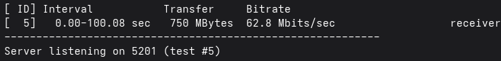
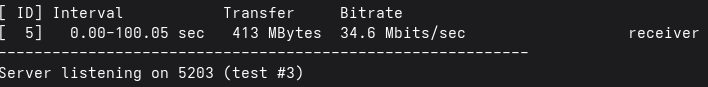

# Section 6. Hierarchical Traffic Shaping & QoS

This section details the setup for weighted traffic shaping on pfSense-HQ's interfaces, with a shared, weighted pool for INTERNAL/DMZ,  an independent hard cap for GUEST, and a hard cap on pfSense-Branch's traffic.

* * *

### Set up limiters and queues

**1\. Create parent WAN limiter**

Go to Firewall -> Traffic Shaper -> Limiters -> New Limiter:

- CORP-DOWN: Enable limiter, Bandwidth: 100Mbit/s
- CORP-UP: Enable limiter, Bandwidth: 100Mbit/s

**2\. Add weighted child queues**

For each newly created parent limiters, create 2 new queues for each zone:

- CORP-DOWN:
    - Q-INTERNAL-DOWN: Enable queue, Queue length: 1000, Weight: 60
    - Q-DMZ-DOWN: Enable queue, Queue length: 1000, Weight: 30
- CORP-UP:
    - Q-INTERNAL-UP: Enable queue, Queue length: 1000, Weight: 60
    - Q-DMZ-UP: Enable queue, Queue length: 1000, Weight: 30

**3\. Create a standalone GUEST limiter**

Create a separate limiter for GUEST:

- GUEST-DOWN: Enable limiter, Bandwidth: 50Mbit/s
- GUEST-UP: Enable limiter, Bandwidth: 50Mbit/s

GUEST is kept as its own top-level limiter rather than a child queue of the main pipe. This gives GUEST a genuine isolated bandwidth that can't pressure or be pressured by the main pool.

**4\. Create a standalone BRANCH limiter**

On Branch, create a separate limiter for BRANCH LAN:

- BRANCH-DOWN: Enable limiter, Bandwidth: 50Mbit/s
- BRANCH-UP: Enable limiter, Bandwidth: 50Mbit/s

* * *

### Configure firewall rules

For all allow rules under each interface, go to Advanced Options -> In/Out pipe, and select the appropriate pipe for the current rule:

- **In pipe (upload traffic):** Map to Q-INTERNAL-UP/ Q-DMZ-UP/GUEST-UP/BRANCH-UP
- **Out pipe (donwload traffic):** Map to Q-INTERNAL-DOWN/Q-DMZ-DOWN/GUEST-DOWN/BRANCH-DOWN

* * *

### Verify

**1\. Traffic test (CORP pool)**

From the physical host (192.168.100.141), run 2 simultaneous iperf3 servers at port 5201 and 5203 to serve two simultaneous test connections from 2 INTERNAL and DMZ hosts:

```Bash
iperf3 -s -p 5201	# From one shell
iperf3 -s -p 5203	# From another shell
```

From the INTERNAL (10.0.10.100) and DMZ (10.0.20.100) hosts, run iperf3 in client mode, sending TCP traffic to respective ports with a set bandwidth of 100 Mbps.

```Bash
iperf3 -c 192.168.100.148 -t 100 -p 5201 -b 100M	# From INTERNAL host
iperf3 -c 192.168.100.148 -t 100 -p 5203 -b 100M	# From DMZ host
```

Results from the physical host iperf3 servers:

 

&nbsp;

The resulting ~1.8-1.9 traffic split matched the configured queue weights.

**2\. Traffic test (GUEST isolation)**

From the GUEST host (10.0.30.100), run iperf3 in client mode, sending TCP traffic to respective ports with a set bandwidth of 100 Mbps.

```Bash
iperf3 -c 192.168.100.148 -t 100 -p 5203 -b 100M	# From GUEST host
```

Result from the physical host iperf3 server:


Despite setting the maximum bandwitdth of the client as 100 Mbps, traffic was capped at 20 Mbps, as configured by the GUEST limiter.

* * *

### Troubleshooting log

**Issue - Weighted split not enforced due to small queue size:**

- Symptom: Concurrent traffic didn't settle into the configured weight ratio, with inconsistent or skewed splits between queues. Previous testing in CORP pool split INTERNAL and DMZ traffic equally.
- Cause: Default queue size (50 slots) was too small for WF2Q+ to enforce weighting — at these throughputs the buffer filled in sub-milliseconds, so droptail dropped packets before the scheduler could apply weights.
- Fix: Increased queue size to 1,000 slots in each child queue.

[<- Previous Section](./Section5.md) | [Next Section ->](./Section7.md)