# Section 7. Remote Access VPNs (WireGuard + OpenVPN) & QoS Extension

This section details remote worker access via two VPN technologies with different routing models, WireGuard (split-tunnel) and OpenVPN (full-tunnel), both terminating on the WAN CARP VIP for failover survivability, plus the additional QoS allocation for REMOTE traffic.

* * *

### Tunnel routing comparison

|     | Split-tunnel | Full-tunnel |
| --- | --- | --- |
| Default route | Unchanged | Replaced via tun0 |
| Corporate traffic | Via tunnel | Via tunnel |
| General internet | Client's own local path | Via tunnel, out pfSense-HQ's WAN |
| Outbound NAT needed | No (Non-corporate traffic never reaches pfSense) | Yes |

Split-tunnel only routes specified subnets through the VPN, leaving everything else (general browsing, local LAN devices) on the client's own path. Full-tunnel rewrites the default route entirely, so all traffic transits the tunnel, which is more auditable but costs more bandwidth/CPU and loses local network access unless explicitly excluded.

* * *

### Set up WireGuard

Configurations are done on **both** Primary and Secondary firewalls, due to XMLRPC not supporting syncing WireGuard configurations natively.

**1\. Installing WireGuard**

From System -> Package Manager -> Available Packages -> Install WireGuard.

**2\. Create the tunnel**

Go to VPN -> WireGuard -> Tunnels -> Add:

- Listen Port: 51820
- Interface Addresses: 10.0.50.1/24
- Generate a new server keypair

**2\. Add the peer**

Switch to Peer tab, add a new peer:

- Tunnel: tun_wg0
- Check Dynamic Endpoint
- Public Key: Generated client-side, pasted here
- Pre-shared Key: Generated on pfSense, copied to client
- Allowed IPs: 10.0.50.0/24

**3\. Set up REMOTE_WG interface**

Assign the created tun_wg0 interface as REMOTE_WG, set static address at 10.0.50.1, and enable the interface.

**4\. Configure firewall rules**

Add the following rules:

- On REMOTE_WG tab: Block REMOTE_WG subnets -> MGMT_subnets, TCP/FW_access_ports on This firewall (self), and GUEST, Allow REMOTE_WG subnets -> any
- On WAN tab: Allow any -> UDP port 51820 on WAN VIP (172.16.1.2)

**5\. Configure CHR port-forwarding**

From the CHR console, add a single-hop DNAT rule to the WAN VIP, not staged through the public IP (see Troubleshooting, issue 1):

```
/ip firewall nat add chain=dstnat in-interface=ether3 dst-address-type=local protocol=udp dst-port=51820 action=dst-nat to-addresses=172.16.1.2 to-ports=51820
```

**6\. Configure remote client (Alpine)**

```
apk add wireguard-tools
cd /etc/wireguard
wg genkey | tee privatekey | wg pubkey > publickey
nano wg0.conf
```

In the tunnel config file, add the following lines:

```
[Interface]
PrivateKey = <Client's private key>
Address = 10.0.50.2/32

[Peer]
PublicKey = <pfSense's public key>
PresharedKey = <pfSense's generated PSK>
Endpoint = <CHR's ether3 address>:51820
AllowedIPs = 10.0.10.0/24, 10.0.20.0/24
```

On the client, initiate the tunnel:

```sh
wg-quick up wg0
```

The WireGuard tunnel after this point should be established.

* * *

### Set up OpenVPN (full-tunnel)

**1\. Installing openvpn-client-export package**

From System -> Package Manager -> Available Packages -> Install openvpn-client-export. This package makes it easier to export OpenVPN Client configurations.

**2\. Managing certificates**

On Primary, go to System -> Certificates -> Authorities -> Add a new certificate authority:

- Descriptive name: Lab-CA
- Method: Create an internal Certificate Authority
- Common Name: lab-ca

Create a new server certificate on the Certificates tab:

- Method: Create an internal Certificate
- Descriptive name: OVPN-Server
- Certficate authority: Lab-CA
- Certificate Type: Server Certificate

Create a new remote user certificate:

- Descriptive name: Remote-OVPN-User
- Certficate authority: Lab-CA
- Certificate Type: User Certificate

**3\. Create the server**

After setting up the certificates, go to VPN -> OpenVPN -> Servers -> Add:

- Server mode: Remote Access (SSL/TLS)
- Device mode: tun - Layer 3 Tunnel Mode
- Protocol: UDP
- Interface: WAN VIP (172.16.1.2)
- Local port: 1194
- Peer Certificate Authority: Lab-CA
- IPv4 Tunnel Network: 10.0.51.0/24
- Check Redirect IPv4 Gateway (this will make all OVPN traffic full-tunnel)
- DNS Server: 10.0.10.1
- Keepalive: Interval 5/Timeout 30 (changed from default 10/60 to cut failover reconnect time)

**4\. **Set up REMOTE_OVPN interface****

Assign the created ovpns1 interface as REMOTE_OVPN and enable the interface.

**5\. Configure firewall rules**

Add the following rules:

- On REMOTE_OVPN tab: Block REMOTE_OVPN subnets -> MGMT_subnets, TCP/FW_access_ports on This firewall (self), and GUEST, Allow REMOTE_OVPN subnets -> any
- On WAN tab: Allow any -> UDP port 51820 on WAN VIP (172.16.1.2)

**6\. Configure outbound NAT rule**

Add a new outbound rule to allow remote full-tunnel traffic to go through WAN:

- Interface: WAN
- Source: IREMOTE_OVPN subnets
- Address: WAN VIP (172.16.1.2)

**7\. RouterOS-CHR port-forward**

Configure the same single-hop pattern as WireGuard, targeting 172.16.1.2:1194.

```
/ip firewall nat add chain=dstnat in-interface=ether3 dst-address-type=local protocol=udp dst-port=1194 action=dst-nat to-addresses=172.16.1.2 to-ports=1194
```

**8\. Client export and connect**

Switch to Client Export tab and download the user configuration files, move the file from the physical host to the VM using SCP and SSH:

```sh
scp <file>.ovpn root@<Remote client address):/etc/openvpn/

```

From the client, connect to HQ through the configuration file

```sh
apk add openvpn
cd /etc/openvpn
modprobe tun
openvpn --config <file>.ovpn --daemon
```

The tunnel should now be established.

* * *

### Extend QoS for REMOTE traffic

Add an extra child queue to manage OpenVPN traffic to previously configured parent limiters, along with modifying set weights of existing child queues. The final weighted pool for each limiter should be:

- CORP-UP (Bandwidth: 100 Mpbs): Q-INTERNAL-UP weight 50, Q-DMZ-UP weight 25, Q-REMOTE-UP weight 25
- CORP-DOWN (Bandwidth: 100 Mpbs): Q-INTERNAL-UP weight 50, Q-DMZ-UP weight 25, Q-REMOTE-UP weight 25
- Firewall allow rules on REMOTE_OVPN: In/Out Pipe assigned to Q-REMOTE-UP/Q-REMOTE-DOWN, same directional pattern as INTERNAL/DMZ.

* * *

### Verify

**1\. Verify WireGuard connection**

Check connection status from pfSense:

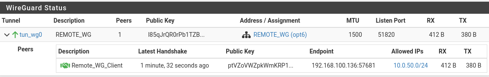

Verify connectivity from client:

```
wg show
ping -c 3 10.0.10.1
```

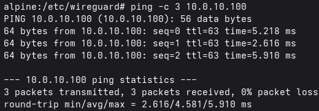

&nbsp;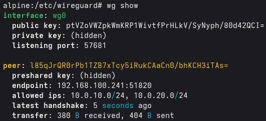

**2\. Verify OpenVPN connection**

Check connection status from pfSense:

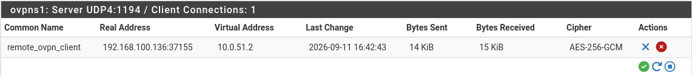

Check routes and full-tunnel connectivity from client:

```
ip route
ping -c 3 10.0.10.1
traceroute google.com
```

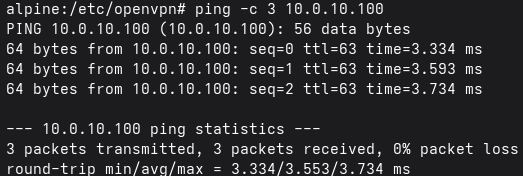

&nbsp;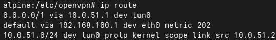

&nbsp;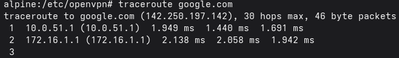

**3\. Traffic test (CORP pool, between INTERNAL and REMOTE)**

From the DMZ host (10.0.20.100), run 2 simultaneous iperf3 servers at port 5201 and 5203 to serve two simultaneous test connections from 2 INTERNAL and REMOTE hosts:

```Bash
iperf3 -s -p 5201	# From one shell
iperf3 -s -p 5203	# From another shell
```

From the INTERNAL (10.0.10.100) and REMOTE (10.0.51.2) hosts, run iperf3 in client mode, sending TCP traffic to respective ports with a set bandwidth of 100 Mbps.

```Bash
iperf3 -c 10.0.20.100 -t 100 -p 5201 -b 100M	# From INTERNAL host
iperf3 -c 10.0.20.100 -t 100 -p 5203 -b 100M	# From REMOTE host
```

Results from the DMZ host iperf3 servers:

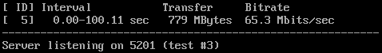

&nbsp;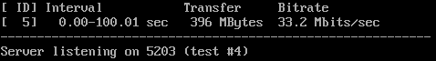

Resulting traffic roughly matches the queue weights.

**4\. Failover**

Ping continuously from the REMOTE host to the INTERNAL host and kill the Primary firewall during the ping:

```Bash
ping 10.0.10.100
```

- WireGuard: ~10 dropped pings, with no extra configurations:

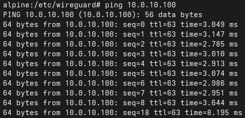

- OpenVPN: ~30 pings lost (~30 seconds) corresponds to the timeout set:

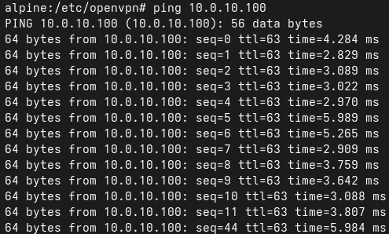

* * *

### Troubleshooting log

**Issue 1 - RouterOS double-NAT hop didn't chain:**

- Symptom: DNAT and forward-filter rules on CHR both showed hit counters, but no traffic reached the interface facing HQ.
- Cause: RouterOS doesn't re-evaluate a packet against earlier dstnat rules once it's already been NAT'd once in that chain, routing through an intermediate virtual address never resolved.
- Fix: Collapsed to a single NAT hop, rather than using the public IP, target the WAN VIP directly.

**Issue 2 - OpenVPN server bound to the real WAN IP instead of the VIP:**

- Symptom: Client connections silently failed with no log entry, "Client Connections: 0."
- Cause: Server interface binding defaulted to Primary's real WAN IP rather than the VIP.
- Fix: Rebound the server to the VIP-associated interface entry.

**Issue 3 - QoS weight skew traced to CPU:**

- Symptom: INTERNAL vs REMOTE concurrent tests consistently settled near 2.5:1 instead of the configured 2:1.
- Cause: pfSense-HQ-Primary hit 100% on a single core during REMOTE (OpenVPN) traffic, AES-256-GCM encryption is single-threaded, capping REMOTE's real throughput below its full weight share before the shaper became the limiting factor.
- Fix: Documented as a CPU/resource-sizing finding, not a QoS defect; add more vCPU for the pfSense VM or a lighter cipher (AES-128-GCM) as a way to get more accurate traffic shaping.

[<- Previous Section](./Section6.md) | [Next Section ->](./Section8.md)