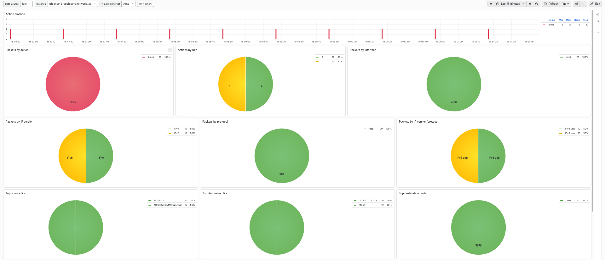
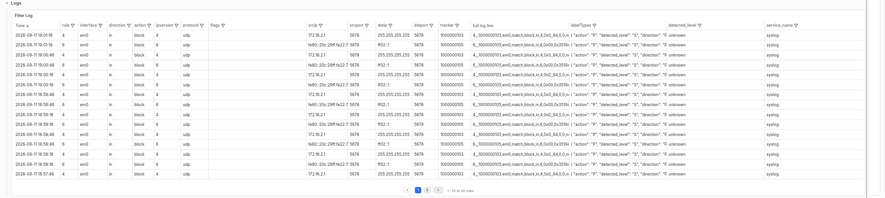

# Section 8. Centralized Logging (Grafana + Loki)

This section details the setup for a logs-only monitoring stack aggregating syslog from all three pfSense boxes (HQ-Primary, HQ-Secondary, Branch) into Loki/Grafana.

* * *

### Configure existing IPsec tunnel

**1\. Add additonal phase 2**

On both HQ-Primary and Branch, VPN -> IPsec -> Tunnels -> existing P1 tunnel -> Add P2:

- HQ-Primary: Local Network: MGMT subnets (10.0.100.0/24), Remote Network: 10.0.101.0/24
- Branch: Local Network: MGMT subnets (10.0.101.0/24), Remote Network: 10.0.100.0/24

**2\. Scoped firewall rule**

On both HQ-Primary and Branch, Firewall -> Rules -> IPsec tab: Allow local MGMT subnet -> remote MGMT subnet.

* * *

### Deploy the monitoring VM

Deploy a monitoring VM on HQ's mgmt subnet at 10.0.100.6. The stack runs a set of Docker Compose services, with the compose file and all container configs kept in /opt/monitoring:

```yaml
services:
  loki:
    image: grafana/loki:latest
    volumes:
      - ./loki:/etc/loki
      - loki-data:/loki
    ports:
      - "3100:3100"
  promtail:
    image: grafana/promtail:latest
    volumes:
      - ./promtail:/etc/promtail
    ports:
      - "514:1514/udp"
  grafana:
    image: grafana/grafana:latest
    volumes:
      - grafana-data:/var/lib/grafana
    ports:
      - "3000:3000"

volumes:
  loki-data:
  grafana-data:
```

Promtail's syslog receiver configurations (promtail/config.yml):

```yaml
scrape_configs:
  - job_name: syslog
    syslog:
      listen_address: 0.0.0.0:1514
      listen_protocol: udp
      labels:
        job: syslog
    relabel_configs:
      - source_labels: [__syslog_message_hostname]
        target_label: hostname
      - source_labels: [__syslog_message_app_name]
        target_label: syslog_app
```

* * *

### Enable remote syslog on pfSense

Repeated on all boxes (HQ-Primary, HQ-Secondary, Branch): Status -> System Logs -> Settings -> Remote Logging Options:

- Log Message Format: syslog (RFC 5424)
- Check send log messages to remote syslog server,
- Remote log servers: 10.0.100.6:514
- Remote Syslog Contents: Firewall Events + VPN Events (for IPsec/charon activity)
- Source Address: Default (any) for HQ FWs, MGMT interface on Branch, left on default, pfSense can select a source interface that doesn't match the IPsec P2 traffic selector, so the packet silently never enters the tunnel.

* * *

### Import dashboard

1\. Add Loki data source

Access Grafana through 10.0.100.6:3000, go to Data sources -> Add new data source, add Loki with URL: http://loki:3100, and confirm via "Save & test".

2\. Import dashboard

Go to Dashboard -> New -> Import dashboard -> Import the repo's preconfigured dashboard (Based on [pfSense/OPNsense Filter by extremempd](https://grafana.com/grafana/dashboards/22722-pfsense-opnsense-filter/))

* * *

### Verify

Confirm logs are arriving and appearing on the dashboard:

 

* * *

### Troubleshooting log

**Issue 1 - Promtail silently dropped all syslog traffic:**

- Symptom: Syslog configured and sending on pfSense, nothing arriving in Loki, no errors on either side.
- Cause: Promtail's syslog receiver defaults to TCP, pfSense was sending UDP.
- Fix: Added listen_protocol: udp explicitly to Promtail's config.

**Issue 2 - RFC3164 vs RFC5424 mismatch:**

- Symptom: Promtail logged "expecting a version value in the range 1-999" and dropped every message.
- Cause: pfSense's default syslog format (RFC3164/BSD) lacks the version and hostname fields Promtail's syslog parser requires.
- Fix: Enabled RFC5424 format in pfSense's remote logging settings on all three boxes.

**Issue 3 - Remote syslog target unreachable caused the logging service to stop entirely:**

- Symptom: pfSense's syslog daemon stopped forwarding logs  to the remote target.
- Cause: pfSense's syslog client doesn't just drop and retry a dead remote target in the background, when the configured remote server becomes unreachable, the logging service itself can stall/restart.
- Fix: Restarted the logging service (Status -> Services) to resume normal operation.

**Issue 4 - Branch's syslog client never sent a packet at all:**

- Symptom: Daemon running, correct target IP, correct content categories, settings saved and re-confirmed, still nothing arriving.
- Cause: Source address in remote logging options left on "Default (any)," causing pfSense to select a source interface/route that didn't align with the mgmt tunnel's P2 selector, so packets never actually entered the IPsec tunnel.
- Fix: Explicitly set Source Address to the MGMT interface.

[<- Previous Section](./Section7.md)